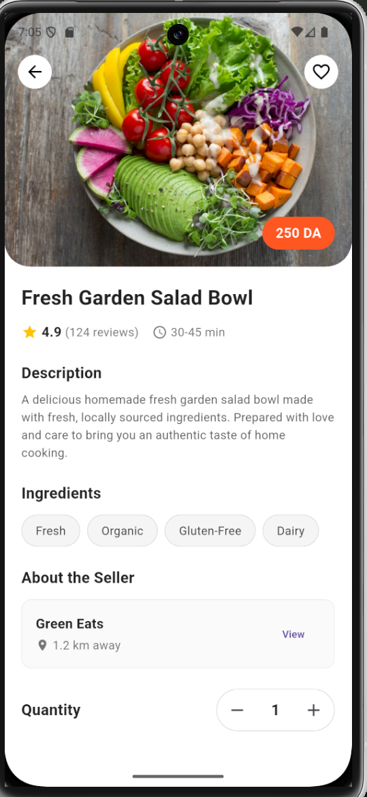

# Makelti — Meal Marketplace Platform

Makelti is a curated meal marketplace that connects home cooks with local customers seeking freshly prepared meals.
This repository is a public showcase of the product concept, features, and architecture.

---

## 📱 App Preview

### Home

### Meal Details

### Order Tracking

---

## Problem

Many people want quick access to high-quality home-prepared meals, while local cooks need a simple way to reach customers and manage orders.

---

## Solution (High Level)

A mobile client enables discovery, favorites, and ordering.
A backend service provides secure APIs, persistent storage, and real-time notifications for order events.

---

## Key Features

- Role-based accounts (customers & cooks)
- Meal listing and discovery
- Ordering workflow and status tracking
- Favorites
- Push notifications

---

## Tech Stack

- Mobile: Flutter (Dart)
- Backend: Python-based web service
- Data: relational database + media storage
- Notifications: push notifications

---

## Architecture (In Words)

Client–server architecture where the mobile app handles UI and interactions,
while the backend manages business logic, data persistence, and notifications.

---

## Source Code & Access

This repository is a public showcase.
The full implementation is private and available upon request for academic or recruiter review.
